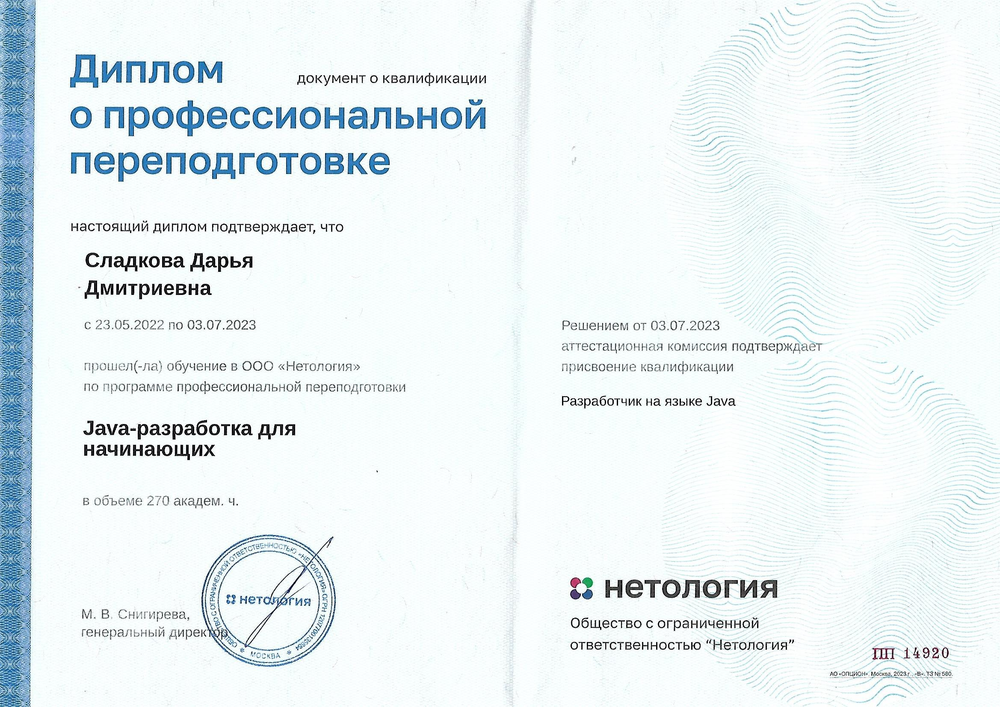
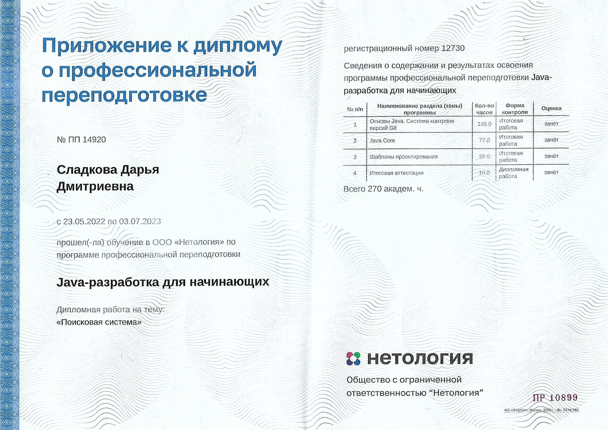
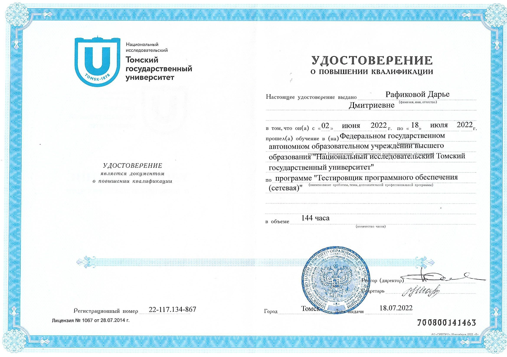

### Hi there! :wave:

Меня зовут Дарья Сладкова, я начинающий тестировщик. Здесь собраны мои учебные проекты на Java, выполненные мной в рамках программы профпереподготовки Нетологии "Java-разработка для начинающих".

#### Мои навыки:
* **JavaCore**
  * Системы сборки проектов Maven, Gradle
  * Работа с форматами данных CSV, XML, JSON
  * Библиотеки JUnit, Mockito
* Основы Git
* Основы SQL
* Знание принципов клиент-серверного взаимодействия
* **QA**
  * Знание теории тестирования, его видов и методов
  * Основы ведения тестовой документации. TestRail
  * Техники тест-дизайна
  * Тестирование веба. Основы DevTools
  * Charles Proxy
  

#### Мои цели:
* соискание должности junior QA engineer,
* изучение автоматизации тестирования.

### Java:
* [Курсовая работа. Менеджер задач](https://github.com/SladkovaDarya/TaskManager)
* [Дипломная работа. Поисковая система](https://github.com/SladkovaDarya/pcs-final-diplom)

#### Диплом о профпереподготовке:

#### Диплом о повышении квалификации:

